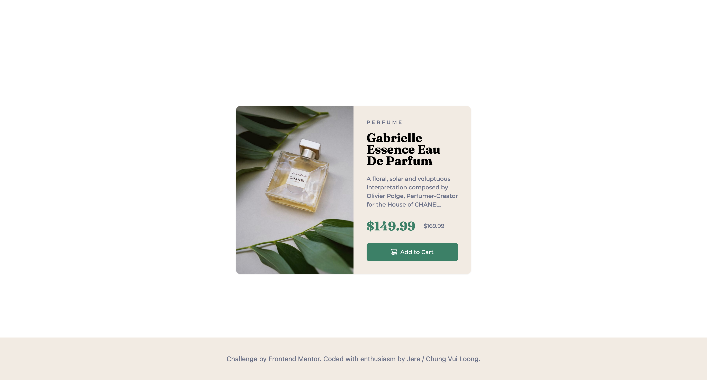

# Frontend Mentor - Product preview card component solution

This is MrJay's solution to the [Product preview card component challenge on Frontend Mentor](https://www.frontendmentor.io/challenges/product-preview-card-component-GO7UmttRfa). Frontend Mentor challenges help me to improve my coding skills by building realistic projects. 

## Table of contents

- [Overview](#overview)
  - [The challenge](#the-challenge)
  - [Screenshot](#screenshot)
- [My process](#my-process)
  - [Built with](#built-with)
  - [What I have Learned](#what-i-learned)
  - [Continued development](#continued-development)
- [Author](#author)

## Overview

### The challenge

Users should be able to:

- View the optimal layout depending on their device's screen size
- See hover and focus states for interactive elements

### Screenshot



### Links

- Solution URL: [Github](https://github.com/chungvuiloong/product-preview-card-component-main)
- Live Site URL: [Vercel](https://mrjays-product-preview-card-component-main.vercel.app/)

## My process

### Built with

- Semantic HTML5 markup
- CSS custom properties
- Flexbox
- Mobile-first workflow
- TailwindCSS

### What I learned

Using this component, it gave me more practice to customise variables:
- the colours
- fontFamily
- fontWeight

```html
      <link rel="preconnect" href="https://fonts.gstatic.com">
      <link href="https://fonts.googleapis.com/css2?family=Montserrat:wght@500;700&display=swap" rel="stylesheet">
      <link rel="preconnect" href="https://fonts.googleapis.com">
      <link rel="preconnect" href="https://fonts.gstatic.com" crossorigin>
      <link href="https://fonts.googleapis.com/css2?family=Fraunces:opsz,wght@9..144,700&display=swap" rel="stylesheet">

      <script src="https://cdn.tailwindcss.com"></script>
      <script>
            tailwind.config = {
                  theme: {
                        extend: {
                              fontFamily: {
                                    'Montserrat': [ 'Montserrat', 'sans-serif '],
                                    'Fraunces': [ 'Fraunces', 'serif']
                              },
                              fontWeight: {
                                    '500': 500,
                                    '700': 700,
                              },
                              colors: {
                                    'Dark-cyan': 'hsl(158, 36%, 37%)',
                                    Cream: 'hsl(30, 38%, 92%)',
                                    'Very-dark-blue': 'hsl(212, 21%, 14%)',
                                    'Dark-grayish-blue': 'hsl(228, 12%, 48%)',
                                    White: 'hsl(0, 0%, 100%)'
                              }
                        }
                  }
            }
      </script>
```

### Continued development

This component can be further developed with different structure. And reused for another project.

## Author

- Website - [MrJay's Simple Portfolio](https://mrjays-simple-portfolio.vercel.app/)
- Github - [Jere / Chung Vui Loong](https://github.com/chungvuiloong)